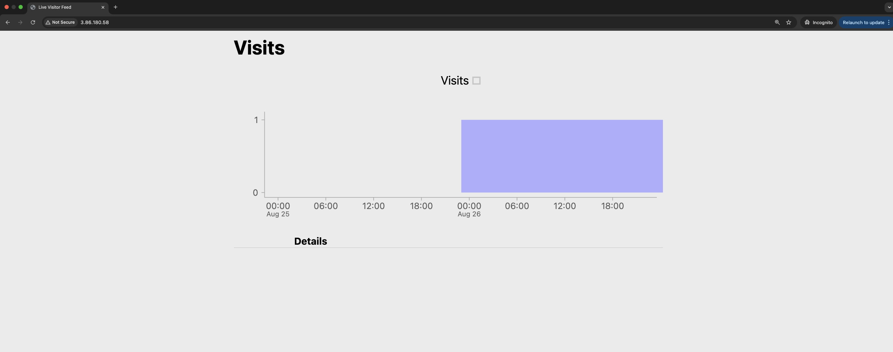

# Terraform Provision

```bash
terraform init
```
```bash
terraform fmt
```

```bash
terraform validate
```
```bash
terraform plan
```

```bash
terraform apply
```


## Pull up the web application and ssh into the web server (optional)

Visit your web application by pointing your browser at the public_ip output for your EC2 instance. To get that address you can look at the state details of the EC2 instance by performing a

```bash
terraform state show aws_instance.ubuntu_server
```

```bash
andrewsbotchway@MacBookPro terraform_build_2 % terraform state show aws_instance.ubuntu_server
# aws_instance.ubuntu_server:

resource "aws_instance" "ubuntu_server" {
    ami                                  = "ami-0fb0b230890ccd1e6"
    arn                                  = "arn:aws:ec2:us-east-1:207567794636:instance/i-034620319f63205d9"
    associate_public_ip_address          = true
    availability_zone                    = "us-east-1b"
    disable_api_stop                     = false
    disable_api_termination              = false
    ebs_optimized                        = false
    force_destroy                        = false
    get_password_data                    = false
    hibernation                          = false
    host_id                              = null
    iam_instance_profile                 = null
    id                                   = "i-034620319f63205d9"
    instance_initiated_shutdown_behavior = "stop"
    instance_lifecycle                   = null
    instance_state                       = "running"
    instance_type                        = "t3.micro"
    ipv6_address_count                   = 0
    ipv6_addresses                       = []
    key_name                             = "MyAWSKey"
    monitoring                           = false
    outpost_arn                          = null
    password_data                        = null
    placement_group                      = null
    placement_partition_number           = 0
    primary_network_interface_id         = "eni-01b79c78470dcff3e"
    private_dns                          = "ip-10-0-101-151.ec2.internal"
    private_ip                           = "10.0.101.151"
    public_dns                           = null
    public_ip                            = "3.86.180.58"
    region                               = "us-east-1"
    secondary_private_ips                = []
    security_groups                      = [
        "sg-01da86833ba4e15cf",
        "sg-040663e4c32f3a43a",
        "sg-0aa24498305caa6ef",
    ]
    source_dest_check                    = true
    spot_instance_request_id             = null
    subnet_id                            = "subnet-0bbe94e463dc14863"
    tags                                 = {
        "Name" = "Ubuntu EC2 Server"
    }
    tags_all                             = {
        "Name" = "Ubuntu EC2 Server"
    }
    tenancy                              = "default"
    user_data_replace_on_change          = false
    vpc_security_group_ids               = [
        "sg-01da86833ba4e15cf",
        "sg-040663e4c32f3a43a",
        "sg-0aa24498305caa6ef",
    ]

    capacity_reservation_specification {
        capacity_reservation_preference = "open"
    }

    cpu_options {
        amd_sev_snp      = null
        core_count       = 1
        threads_per_core = 2
    }

    credit_specification {
        cpu_credits = "unlimited"
    }

    enclave_options {
        enabled = false
    }

    maintenance_options {
        auto_recovery = "default"
    }

    metadata_options {
        http_endpoint               = "enabled"
        http_protocol_ipv6          = "disabled"
        http_put_response_hop_limit = 1
        http_tokens                 = "optional"
        instance_metadata_tags      = "disabled"
    }

    primary_network_interface {
        delete_on_termination = true
        network_interface_id  = "eni-01b79c78470dcff3e"
    }

    private_dns_name_options {
        enable_resource_name_dns_a_record    = false
        enable_resource_name_dns_aaaa_record = false
        hostname_type                        = "ip-name"
    }

    root_block_device {
        delete_on_termination = true
        device_name           = "/dev/sda1"
        encrypted             = false
        iops                  = 100
        kms_key_id            = null
        tags                  = {}
        tags_all              = {}
        throughput            = 0
        volume_id             = "vol-064494ca426c09614"
        volume_size           = 8
        volume_type           = "gp2"
    }
}
```

Visit `http://<public_ip>`



### SSH to the EC2 instance

ssh to your EC2 instance with a command like `ssh -i MyAWSKey.pem ubuntu@<public_ip>`. Type yes when prompted to use the key. Type `exit` to quit the ssh session.

```shell
ssh -i MyAWSKey.pem ubuntu@<public_ip>
```

### Clean up

```shell
terraform destroy
```
